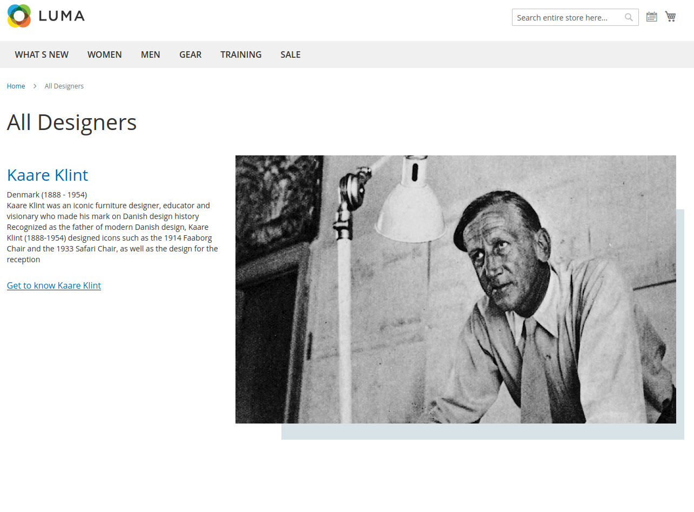
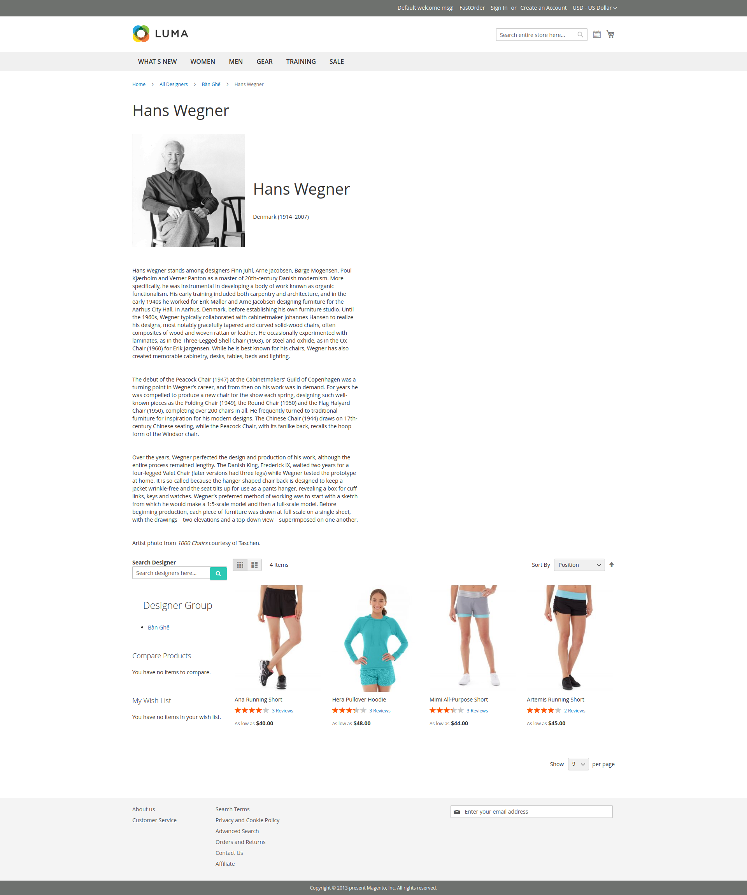
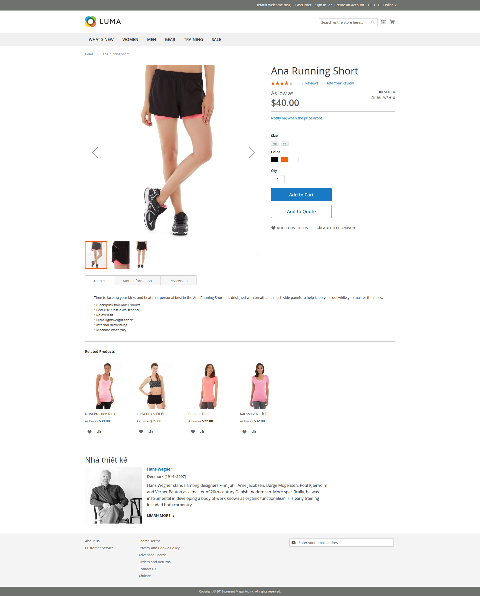

# magento-2-designer

Magento 2 Designer Extension FREE: https://landofcoder.com/magento-2-designer.html/

LandOfCoder provide a best FREE Magento 2 Designer Extension for your eCommerce website. The module allows the admin to manage all product designers from the backend. Also, the store owner can assign personalized or custom products to specific designers.

What's more? This Magento 2 product designer gives your customers possibility to filter designers to find out the one they prefer on the frontend. They also can view all information of any designer on the product detail page with ease.

**Example view:**
- https://onwood.vn/nha-thiet-ke
- https://www.carlhansen.com/en/designers
- https://www.dwr.com/subdesigners?lang=en_US

# Setup

 1. Setup via composer

Setup the module via composer:

    composer require landofcoder/module-designer
    php bin/magento module:enable Lof_Designer
    php bin/magento setup:upgrade
    php bin/magento setup:static-content:deploy -f

## Preview

1. All Designer Page

2. View Detial Designer Page

3. Designer Info On Product Page

## Highlight Features

1. Display designers on various designers page layouts

With Magento 2 designer extension free, the admin can build a special designers page on the frontend. In this page, the list of all designers will be shown with details in different layouts.

Designer Name
Birthday Information
Country
Description
Link to detail profile page
Photo

2. View detail designer page

After designer profiles are created, your visitors / customers can view any designer information from the redirect link on the product page or the designers page. Visitors will be redirected to a specific designer page. They can get any information of the product designer such as name, photo, description, country, birthday, designer group, products by this designer and other designers. The design page also contains a seach box for customers to find a designer they like.

3. Show designer info at the end of product page

It would be much convenient for visitors/ customers if they want to check who designed the product they are looking at. On each product page, visitors can check some main information of the product designer and further check the detail designer page as well by clicking on ''Learn More''.

4. Fast assign products to designer

In free Magento 2 product designer extension, when you create a new product, there's an option to assign it to a designer. Just choose a designer name from the available list in ''Product Designer'' field. Then, the information of chosen designer will be shown visibly on the product page.

5. Add multiple product designers in backend

Magento 2 designer extension free allows the admin to add unlimited new designers from the backend with ease. The store ownner can have an overview of all existing product designers (name, id, thumbnail, image, url key, page title, meta keywords, status, meta description, position) and edit any designer details to manage them more effectively.

Notably, the admin are enabled to migrate available designers to save lots of time and effort.

6. Easily add / edit designer information

Magento 2 product designer extension enables you to add new or edit existing designer information quickly. You can change and update any detail of a specific product designer by filling out those fields:

<ul>
 <li>Designer Name (required)</li>
<li>URL Key (auto create url key)</li>
<li>Designer Groups (required): sellect one of available groups</li>
<li>Image</li>
<li>Thumbnail</li>
<li>Description (created by powerful editor tool)</li>
<li>Store View (required): choose the store view you want to show this designer page</li>
<li>Birthday Info</li>
<li>Contact Name</li>
<li>Email</li>
<li>Telephone</li>
<li>Street</li>
<li>Website</li>
<li>Country: select a country from the list</li>
<li>State: select a region, state or province</li>
<li>Region</li>
<li>City</li>
<li>Postcode</li>
<li>Position</li>
<li>Status: choose Enabled / Disabled</li>
 </ul>

7. Create multiple designer groups

The admin in our free Magento 2 designer extension can add many new designer groups in short time. In addition, it's super easy for the store admin to take control of all designer groups, track any group details by filtering id, name, url key, status, position, and edit information of any group in needed.

8. Quickly add / edit specific designer groups

In the ''Group Information'' of Magento 2 designer module, the admin will have a chance to set details of a new designer group or change any detail of specific groups in few seconds.

<ul>
<li>Group Name (required)</li>
<li>URL Key (auto created)</li>
<li>Position</li>
<li>Status: Enabled / Disabled</li>
<li>Show In Sidebar: Enabled / Disabled</li>
 </ul>

9. Manage products of particular designers

Free Magento 2 designer allows you to manage all designer's products. The admin can assign products to a designer when creating a product. In this field, you also can assign any product to specific designer. You can filter to search any item and tick to products you want to assign. It's super easy!

10. Set stunning designer page layout

For each product designer page layout, the admin can set with a special layout with different columns, right bar or left bar. You also can make design page layout more outstanding with ''Layout Update XML''. This layout will be displayed on the frontend and attract visitors will well design and informative content.

11. Optimize SEO remarkably for designer pages

Don't miss out to optimize your SEO page to drive your website to higher rank! This magento 2 page designer will be a worthy extension for you. To boost SEO rank for each designer page, you can take actions in ''Meta Data'', set Page Title, Keywords & Description.

12. Add product designer attribute

In the ''Product Attributes'' management, you can creat a new attribute for product designer with ease.

13. Configure General Settings

<ul>
 <li>Enable: choose Yes / No to enable or disable Magento 2 designer module</li>
<li>Designer List Url</li>
<li>Designer Url Prefix</li>
<li>Designer Url Suffix</li>
<li>Enable Designer Categories Menu: Yes / No</li>
<li>Enable Search Design Block: Yes / No</li>
</ul> 
 
Customers can easily search any designers on the frontend

14. Configure Migration Settings

Attribute Code To Migration: input the product attribute code to migrate designer information of products into designer table
Default Designer Group Id To Use To Migration: input designer group id to use as the default group id when you migrate

15. Configure Designer Info On Product View Page

<ul>
<li>Enabled Designer Block: Yes / No</li>
<li>Show Designer As Listing: Yes / No</li>
<li>Show Designer Text: Yes / No</li>
<li>Show Designer Description: Yes / No</li>
<li>Show Description Length: add a number of words</li>
<li>Designer Text: set the title for designers page</li>
<li>Show Designer Logo: Yes / No</li>
<li>Show Designer Name: Yes / No</li>
</ul>

16. Configure Designer List Page

<ul>
<li>Layout: select a design</li>
<li>Pretext HTML (show / hide editor, insert widget, insert image, insert variable)</li>
<li>Show Designer Name: Yes / No</li>
<li>Designer Description Length: enter a number</li>
<li>Number Designer Per Page: enter a number or empty to show all</li>
 </ul>
 
Configure SEO-Search Engine Optimization

<ul>
<li>Page Title</li>
<li>Meta Description</li>
<li>Meta Keywords</li>
 </ul>

Configure Grid Layout

<ul>
<li>Number Column on Large Desktop</li>
<li>Number Column on Desktop Number Column on Tablets Number Column on Phones</li>
 </ul>

17. Configure Group Page

<ul>
<li>Show Designer Name: Yes / No</li>
<li>Designer Description Length: add a number of words</li>
<li>Number Designer Per Page: add a number or emty to show all designers</li>
<li>Number Column on Large Desktop</li>
<li>Number Column on Desktop</li>
<li>Number Column on Tablets</li>
<li>Number Column on Phones</li>
</ul>

18. Configure Designer Block

<ul>
<li>Enable: Yes / No</li>
<li>Title</li>
<li>Pretext HTML (show / hide editor, insert widget, insert image, insert variable)</li>
<li>Designer Group</li>
<li>Show Designer Name: Yes / No</li>
<li>Number of Designer to Display: enter a number</li>
<li>Addition Class</li>
<li>Carousel Layout: choose a layout</li>
<li>Number Item per Column (default is 1)</li>
<li>Number Columns On Page (Phones)</li>
<li>Number Columns On Page (Phones to Small tablets)</li>
<li>Number Columns On Page (Phones to tablets)</li>
<li>Number Columns On Page (Portrait tablets)</li>
<li>Number Columns On Page (Default)</li>
<li>Number Columns On Page (Large display)</li>
<li>Autoplay: Yes / No</li>
<li>Autoplay Timeout: enter a number</li>
<li>Pause on Hover: Yes / No</li>
<li>Loop: Yes / No</li>
<li>RTL: Yes / No</li>
<li>Show dots navigation: Yes / No</li>
<li>Show next/prev buttons: Yes / No</li>
<li>Nav Prev: Prev</li>
<li>Nav Next: Next</li>
</ul>

## Best Selling Magento 2 Extensions

<ul><li><a href="https://landofcoder.com/magento-2-blog-extension.html/">Magento 2 Blog Extension </a></li><li><a href="https://landofcoder.com/magento-2-cash-on-delivery-extension.html/">Magento 2 Cash On Delivery</a></li><li><a href="https://landofcoder.com/magento-2-form-builder.html/">Magento 2 Form Builder</a></li><li><a href="https://landofcoder.com/magento-2-sales-rep-extension.html/">Magento 2 Sales Rep Extension</a></li><li><a href="https://landofcoder.com/magento-2-image-gallery-pro.html">Magento 2 Image Gallery Pro</a></li><li><a href="https://landofcoder.com/magento-2-page-builder.html/">Magento 2 Page Builer Extension</a></li><li><a href="https://landofcoder.com/magento-2-quote-extension.html">Magento 2 Customer Quotation</a></li><li><a href="https://landofcoder.com/magento-2-marketplace-extension.html">Magento 2 Marketplace Extension</a></li><li><a href="https://landofcoder.com/advanced-magento-2-product-reviews.html/">Magento 2 Product Reviews Extension</a></li><li><a href="https://landofcoder.com/magento-2-store-pickup.html/">Magento 2 Store Pickup</a> </li><li><a href="https://landofcoder.com/magento-2-product-attachments.html/">Magento 2 Product Attachments</a></li><li><a href="https://landofcoder.com/magento-2-mega-menu-pro.html">Magento 2 Mega Menu Pro</a></li><li><a href="https://landofcoder.com/magento-2-marketplace-seller-coupons.html/">Magento 2 Marketplace Seller Coupons</a></li><li><a href="https://landofcoder.com/magento-2-sales-rep-extension.html/">Magento 2 Sales Rep</a></li>
<li><a href="https://landofcoder.com/magento-2-one-step-checkout.html/">Magento 2 One Step Checkout</a></li></ul>
